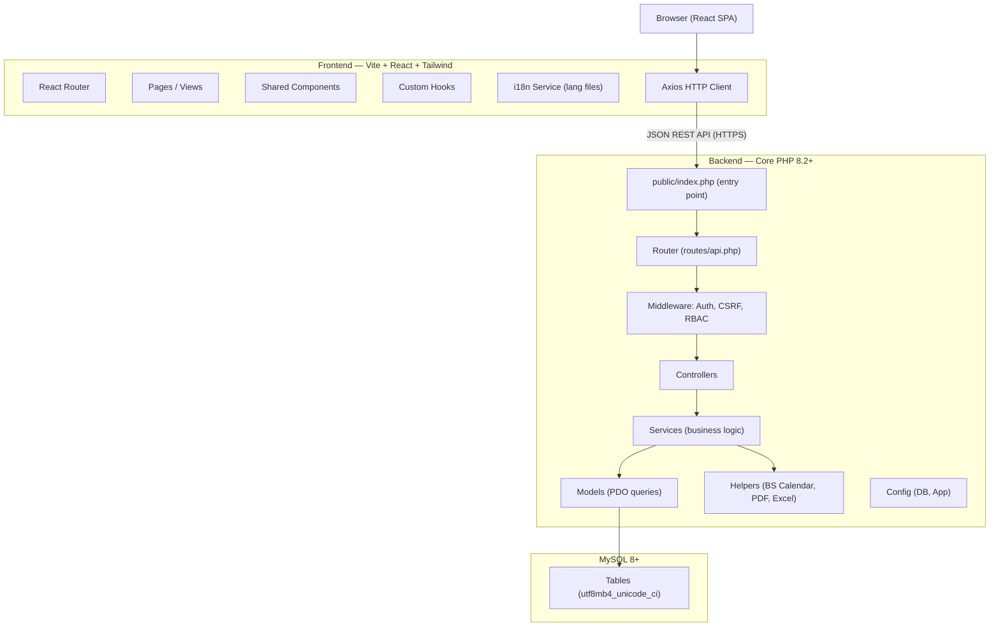
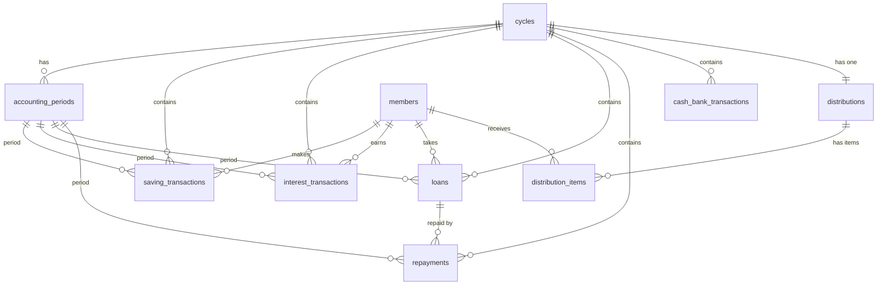

# Design Document — Village Cooperative Management System (VCMS)

## Overview

The Village Cooperative Management System (VCMS) is a web application built for small village savings cooperatives in Nepal. It manages member savings, loans, interest calculations, cash/bank accounting, and end-of-cycle distributions. The system operates on the Bikram Sambat (BS) Nepali calendar, supports bilingual UI (English and Nepali), and enforces strict single-open-period accounting controls.

The architecture separates concerns into three tiers:
- **Frontend** — React SPA (Vite + Tailwind CSS), communicates with the backend exclusively via REST API
- **Backend** — Core PHP 8.2+ MVC application serving a JSON REST API, no framework
- **Database** — MySQL 8+ with utf8mb4 / utf8mb4_unicode_ci, strict schema standards

---

## Architecture

### System Architecture Diagram




### Request Lifecycle

1. React component triggers an Axios call with the CSRF token in the `X-CSRF-Token` header and the session cookie automatically attached.
2. `public/index.php` bootstraps config, starts the session, and dispatches to `Router`.
3. `Router` matches the route and runs the middleware stack: `AuthMiddleware` → `CsrfMiddleware` → `RbacMiddleware`.
4. The matched `Controller` receives the request, delegates business logic to a `Service`, which calls one or more `Model` methods via PDO prepared statements.
5. The `Service` returns a result object; the `Controller` serializes it as JSON and sends the HTTP response.
6. Audit logging is written by `AuditLogger` inside each `Service` method, never in controllers.

---

## Components and Interfaces

### Backend Component Map

```
backend/
├── public/
│   ├── index.php              # Entry point: bootstrap, session start, dispatch
│   └── uploads/
│       ├── backups/           # .sql.gz backup files
│       └── logs/              # Filesystem audit-failure logs
└── app/
    ├── config/
    │   ├── Database.php       # PDO singleton factory
    │   └── App.php            # App constants, base URL, environment
    ├── middleware/
    │   ├── AuthMiddleware.php  # Session validation, timeout
    │   ├── CsrfMiddleware.php  # Token validation on state-changing requests
    │   └── RbacMiddleware.php  # Role-based route guards
    ├── routes/
    │   └── api.php            # Route table: METHOD, path, Controller@action, roles[]
    ├── controllers/
    │   ├── AuthController.php
    │   ├── AdminController.php
    │   ├── MemberController.php
    │   ├── AccountingPeriodController.php
    │   ├── SavingsController.php
    │   ├── LoanController.php
    │   ├── CashBankController.php
    │   ├── DashboardController.php
    │   ├── DistributionController.php
    │   ├── ReportController.php
    │   ├── AuditController.php
    │   └── BackupController.php
    ├── models/
    │   ├── AdminModel.php
    │   ├── MemberModel.php
    │   ├── AccountingPeriodModel.php
    │   ├── CycleModel.php
    │   ├── SavingTransactionModel.php
    │   ├── InterestTransactionModel.php
    │   ├── LoanModel.php
    │   ├── RepaymentModel.php
    │   ├── CashBankTransactionModel.php
    │   ├── DistributionModel.php
    │   └── AuditLogModel.php
    ├── services/
    │   ├── AuthService.php
    │   ├── AdminService.php
    │   ├── MemberService.php
    │   ├── MonthCloseService.php
    │   ├── SavingsService.php
    │   ├── InterestService.php
    │   ├── LoanService.php
    │   ├── CashBankService.php
    │   ├── DistributionService.php
    │   ├── ReportService.php
    │   ├── BackupService.php
    │   └── AuditLogger.php
    ├── helpers/
    │   ├── BsCalendar.php     # BS↔AD conversions, next-month logic
    │   ├── PdfGenerator.php   # Distribution + report PDF (using TCPDF or mPDF)
    │   ├── ExcelExporter.php  # XLSX export (PhpSpreadsheet)
    │   ├── Response.php       # JSON response builder
    │   └── Validator.php      # Input validation helpers
    └── api/
        └── (reserved for versioned API wrappers if needed)
```


### Frontend Component Map

```
frontend/src/
├── main.jsx                   # Vite entry, ReactDOM.render
├── App.jsx                    # BrowserRouter, route definitions
├── assets/                    # Images, fonts, static files
├── layouts/
│   ├── AuthLayout.jsx         # Login/logout wrapper (no sidebar)
│   └── AppLayout.jsx          # Sidebar + header + language toggle
├── pages/
│   ├── Login.jsx
│   ├── Dashboard.jsx
│   ├── Members/
│   │   ├── MemberList.jsx
│   │   ├── MemberForm.jsx
│   │   └── MemberStatement.jsx
│   ├── Savings/
│   │   └── BulkCollection.jsx
│   ├── Loans/
│   │   ├── LoanList.jsx
│   │   ├── LoanForm.jsx
│   │   └── RepaymentForm.jsx
│   ├── CashBank/
│   │   ├── CashBook.jsx
│   │   └── TransferForm.jsx
│   ├── Distribution/
│   │   ├── DistributionLedger.jsx
│   │   └── DistributionConfirm.jsx
│   ├── Reports/
│   │   ├── ReportSelector.jsx
│   │   └── ReportViewer.jsx
│   ├── Audit/
│   │   └── AuditLog.jsx
│   ├── Admin/
│   │   ├── AdminList.jsx
│   │   └── AdminForm.jsx
│   ├── Settings/
│   │   └── Settings.jsx
│   └── Backup/
│       └── BackupRestore.jsx
├── components/
│   ├── ui/
│   │   ├── Button.jsx
│   │   ├── Card.jsx
│   │   ├── Modal.jsx
│   │   ├── Table.jsx          # Search, sort, paginate, export controls
│   │   ├── Badge.jsx
│   │   ├── Alert.jsx
│   │   └── Spinner.jsx
│   ├── forms/
│   │   ├── FormField.jsx      # Label + input + validation message
│   │   ├── SelectField.jsx
│   │   └── DatePickerBS.jsx   # BS calendar date picker
│   └── layout/
│       ├── Sidebar.jsx
│       ├── Header.jsx         # Language toggle, user menu
│       └── PageHeader.jsx
├── hooks/
│   ├── useAuth.jsx            # Auth state + login/logout
│   ├── useI18n.jsx            # t() translation function
│   ├── usePagination.jsx
│   └── useApi.jsx             # Axios wrapper with CSRF token injection
├── services/
│   ├── api.js                 # Axios instance, base URL, interceptors
│   ├── authService.js
│   ├── memberService.js
│   ├── savingsService.js
│   ├── loanService.js
│   ├── cashBankService.js
│   ├── distributionService.js
│   ├── reportService.js
│   └── backupService.js
└── utils/
    ├── bsDate.js              # BS date formatting/display
    ├── currency.js            # NPR formatting, rounding
    └── validators.js          # Client-side validation rules
```

---

## Data Models

### Database Schema

All tables follow Requirement 16 standards: `id`, `created_at`, `updated_at`, `created_by`, `updated_by`, `status` columns; utf8mb4 character set; utf8mb4_unicode_ci collation; ON DELETE RESTRICT on financial foreign keys.


#### Table: `admins`

| Column | Type | Constraints | Notes |
|---|---|---|---|
| id | BIGINT UNSIGNED | PK, AUTO_INCREMENT | |
| name | VARCHAR(100) | NOT NULL | |
| username | VARCHAR(50) | NOT NULL, UNIQUE | |
| password_hash | VARCHAR(255) | NOT NULL | bcrypt, cost ≥ 10 |
| phone | VARCHAR(15) | NULL | |
| role | ENUM('Admin','Super_Admin') | NOT NULL DEFAULT 'Admin' | |
| failed_login_count | TINYINT UNSIGNED | NOT NULL DEFAULT 0 | |
| locked_until | DATETIME | NULL | UTC; NULL = not locked |
| remember_token | VARCHAR(64) | NULL | Secure random token |
| remember_token_expires | DATETIME | NULL | UTC |
| status | TINYINT UNSIGNED | NOT NULL DEFAULT 1 | 1=Active, 0=Inactive |
| created_at | DATETIME | NOT NULL DEFAULT CURRENT_TIMESTAMP | |
| updated_at | DATETIME | NOT NULL DEFAULT CURRENT_TIMESTAMP ON UPDATE CURRENT_TIMESTAMP | |
| created_by | BIGINT UNSIGNED | NULL | FK → admins.id |
| updated_by | BIGINT UNSIGNED | NULL | FK → admins.id |

Indexes: `username` (UNIQUE), `status`

---

#### Table: `cycles`

| Column | Type | Constraints | Notes |
|---|---|---|---|
| id | BIGINT UNSIGNED | PK, AUTO_INCREMENT | |
| cycle_number | SMALLINT UNSIGNED | NOT NULL | Sequential: 1, 2, 3 … |
| name | VARCHAR(100) | NOT NULL | e.g. "Cycle 1" |
| cycle_status | ENUM('Active','Completed') | NOT NULL DEFAULT 'Active' | |
| started_at_bs_year | SMALLINT UNSIGNED | NOT NULL | |
| started_at_bs_month | TINYINT UNSIGNED | NOT NULL | 1=Baishakh … 12=Chaitra |
| ended_at_bs_year | SMALLINT UNSIGNED | NULL | Set on completion |
| ended_at_bs_month | TINYINT UNSIGNED | NULL | |
| status | TINYINT UNSIGNED | NOT NULL DEFAULT 1 | Standard column |
| created_at | DATETIME | NOT NULL DEFAULT CURRENT_TIMESTAMP | |
| updated_at | DATETIME | NOT NULL DEFAULT CURRENT_TIMESTAMP ON UPDATE CURRENT_TIMESTAMP | |
| created_by | BIGINT UNSIGNED | NULL | FK → admins.id |
| updated_by | BIGINT UNSIGNED | NULL | FK → admins.id |

Indexes: `cycle_status`, `cycle_number`

---

#### Table: `accounting_periods`

| Column | Type | Constraints | Notes |
|---|---|---|---|
| id | BIGINT UNSIGNED | PK, AUTO_INCREMENT | |
| cycle_id | BIGINT UNSIGNED | NOT NULL, FK → cycles.id RESTRICT | |
| bs_year | SMALLINT UNSIGNED | NOT NULL | e.g. 2083 |
| bs_month | TINYINT UNSIGNED | NOT NULL | 1–12 |
| period_status | ENUM('OPEN','CLOSED') | NOT NULL DEFAULT 'OPEN' | |
| closed_at | DATETIME | NULL | UTC timestamp |
| closed_by | BIGINT UNSIGNED | NULL | FK → admins.id |
| summary_json | JSON | NULL | Month-close summary snapshot |
| status | TINYINT UNSIGNED | NOT NULL DEFAULT 1 | |
| created_at | DATETIME | NOT NULL DEFAULT CURRENT_TIMESTAMP | |
| updated_at | DATETIME | NOT NULL DEFAULT CURRENT_TIMESTAMP ON UPDATE CURRENT_TIMESTAMP | |
| created_by | BIGINT UNSIGNED | NULL | FK → admins.id |
| updated_by | BIGINT UNSIGNED | NULL | FK → admins.id |

Indexes: `bs_year`, `bs_month`, `period_status`, UNIQUE(`bs_year`, `bs_month`, `cycle_id`)

---

#### Table: `settings`

| Column | Type | Constraints | Notes |
|---|---|---|---|
| id | BIGINT UNSIGNED | PK, AUTO_INCREMENT | |
| setting_key | VARCHAR(100) | NOT NULL, UNIQUE | |
| setting_value | TEXT | NOT NULL | |
| description | VARCHAR(255) | NULL | |
| status | TINYINT UNSIGNED | NOT NULL DEFAULT 1 | |
| created_at | DATETIME | NOT NULL DEFAULT CURRENT_TIMESTAMP | |
| updated_at | DATETIME | NOT NULL DEFAULT CURRENT_TIMESTAMP ON UPDATE CURRENT_TIMESTAMP | |
| created_by | BIGINT UNSIGNED | NULL | |
| updated_by | BIGINT UNSIGNED | NULL | |

Key settings: `cooperative_name`, `fixed_monthly_saving` (default 1000), `interest_rate_annual` (locked at 12), `default_language` (en/ne)


---

#### Table: `members`

| Column | Type | Constraints | Notes |
|---|---|---|---|
| id | BIGINT UNSIGNED | PK, AUTO_INCREMENT | |
| member_id | VARCHAR(10) | NOT NULL, UNIQUE | Format: B000001 |
| member_seq | INT UNSIGNED | NOT NULL, UNIQUE | Raw sequence for ID generation |
| full_name | VARCHAR(100) CHARACTER SET utf8mb4 COLLATE utf8mb4_unicode_ci | NOT NULL | Supports Nepali |
| phone | VARCHAR(15) | NOT NULL | 7–15 digits |
| address | VARCHAR(255) CHARACTER SET utf8mb4 COLLATE utf8mb4_unicode_ci | NULL | |
| join_date_bs_year | SMALLINT UNSIGNED | NOT NULL | |
| join_date_bs_month | TINYINT UNSIGNED | NOT NULL | |
| join_date_bs_day | TINYINT UNSIGNED | NOT NULL | |
| join_date_ad | DATE | NOT NULL | AD equivalent for storage |
| notes | TEXT CHARACTER SET utf8mb4 COLLATE utf8mb4_unicode_ci | NULL | max 500 chars enforced at app layer |
| status | TINYINT UNSIGNED | NOT NULL DEFAULT 1 | 1=Active, 0=Inactive |
| created_at | DATETIME | NOT NULL DEFAULT CURRENT_TIMESTAMP | |
| updated_at | DATETIME | NOT NULL DEFAULT CURRENT_TIMESTAMP ON UPDATE CURRENT_TIMESTAMP | |
| created_by | BIGINT UNSIGNED | NULL | FK → admins.id |
| updated_by | BIGINT UNSIGNED | NULL | FK → admins.id |

Indexes: `member_id` (UNIQUE), `phone`, `full_name` (FULLTEXT for substring search), `status`

---

#### Table: `saving_transactions`

| Column | Type | Constraints | Notes |
|---|---|---|---|
| id | BIGINT UNSIGNED | PK, AUTO_INCREMENT | |
| cycle_id | BIGINT UNSIGNED | NOT NULL, FK → cycles.id RESTRICT | |
| accounting_period_id | BIGINT UNSIGNED | NOT NULL, FK → accounting_periods.id RESTRICT | |
| member_id | BIGINT UNSIGNED | NOT NULL, FK → members.id RESTRICT | |
| amount | DECIMAL(15,2) | NOT NULL | Must be > 0 |
| transaction_date_bs_year | SMALLINT UNSIGNED | NOT NULL | |
| transaction_date_bs_month | TINYINT UNSIGNED | NOT NULL | |
| transaction_date_ad | DATE | NOT NULL | |
| remarks | VARCHAR(255) | NULL | |
| status | TINYINT UNSIGNED | NOT NULL DEFAULT 1 | |
| created_at | DATETIME | NOT NULL DEFAULT CURRENT_TIMESTAMP | |
| updated_at | DATETIME | NOT NULL DEFAULT CURRENT_TIMESTAMP ON UPDATE CURRENT_TIMESTAMP | |
| created_by | BIGINT UNSIGNED | NULL | FK → admins.id |
| updated_by | BIGINT UNSIGNED | NULL | FK → admins.id |

Indexes: `member_id`, `accounting_period_id`, `cycle_id`, UNIQUE(`member_id`, `accounting_period_id`) — prevents duplicate monthly saving

---

#### Table: `interest_transactions`

| Column | Type | Constraints | Notes |
|---|---|---|---|
| id | BIGINT UNSIGNED | PK, AUTO_INCREMENT | |
| cycle_id | BIGINT UNSIGNED | NOT NULL, FK → cycles.id RESTRICT | |
| accounting_period_id | BIGINT UNSIGNED | NOT NULL, FK → accounting_periods.id RESTRICT | |
| member_id | BIGINT UNSIGNED | NOT NULL, FK → members.id RESTRICT | |
| amount | DECIMAL(15,2) | NOT NULL | Computed interest, > 0 |
| balance_before | DECIMAL(15,2) | NOT NULL | Savings balance used for calculation |
| status | TINYINT UNSIGNED | NOT NULL DEFAULT 1 | |
| created_at | DATETIME | NOT NULL DEFAULT CURRENT_TIMESTAMP | |
| updated_at | DATETIME | NOT NULL DEFAULT CURRENT_TIMESTAMP ON UPDATE CURRENT_TIMESTAMP | |
| created_by | BIGINT UNSIGNED | NULL | FK → admins.id |
| updated_by | BIGINT UNSIGNED | NULL | FK → admins.id |

Indexes: `member_id`, `accounting_period_id`, `cycle_id`


---

#### Table: `loans`

| Column | Type | Constraints | Notes |
|---|---|---|---|
| id | BIGINT UNSIGNED | PK, AUTO_INCREMENT | |
| cycle_id | BIGINT UNSIGNED | NOT NULL, FK → cycles.id RESTRICT | |
| accounting_period_id | BIGINT UNSIGNED | NOT NULL, FK → accounting_periods.id RESTRICT | |
| member_id | BIGINT UNSIGNED | NOT NULL, FK → members.id RESTRICT | |
| loan_amount | DECIMAL(15,2) | NOT NULL | 1–999,999,999 |
| outstanding_principal | DECIMAL(15,2) | NOT NULL | Updated on repayment |
| accrued_interest | DECIMAL(15,2) | NOT NULL DEFAULT 0.00 | Updated on repayment |
| interest_rate | DECIMAL(5,2) | NOT NULL | 0.01–100.00 % |
| loan_date_bs_year | SMALLINT UNSIGNED | NOT NULL | |
| loan_date_bs_month | TINYINT UNSIGNED | NOT NULL | |
| loan_date_ad | DATE | NOT NULL | |
| loan_status | ENUM('Outstanding','Completed','Cancelled') | NOT NULL DEFAULT 'Outstanding' | |
| remarks | TEXT CHARACTER SET utf8mb4 COLLATE utf8mb4_unicode_ci | NULL | |
| status | TINYINT UNSIGNED | NOT NULL DEFAULT 1 | |
| created_at | DATETIME | NOT NULL DEFAULT CURRENT_TIMESTAMP | |
| updated_at | DATETIME | NOT NULL DEFAULT CURRENT_TIMESTAMP ON UPDATE CURRENT_TIMESTAMP | |
| created_by | BIGINT UNSIGNED | NULL | FK → admins.id |
| updated_by | BIGINT UNSIGNED | NULL | FK → admins.id |

Indexes: `member_id`, `accounting_period_id`, `cycle_id`, `loan_status`

---

#### Table: `repayments`

| Column | Type | Constraints | Notes |
|---|---|---|---|
| id | BIGINT UNSIGNED | PK, AUTO_INCREMENT | |
| loan_id | BIGINT UNSIGNED | NOT NULL, FK → loans.id RESTRICT | |
| cycle_id | BIGINT UNSIGNED | NOT NULL, FK → cycles.id RESTRICT | |
| accounting_period_id | BIGINT UNSIGNED | NOT NULL, FK → accounting_periods.id RESTRICT | |
| repayment_type | ENUM('PrincipalOnly','InterestOnly','Both') | NOT NULL | |
| amount | DECIMAL(15,2) | NOT NULL | Total payment amount |
| principal_paid | DECIMAL(15,2) | NOT NULL DEFAULT 0.00 | |
| interest_paid | DECIMAL(15,2) | NOT NULL DEFAULT 0.00 | |
| repayment_date_bs_year | SMALLINT UNSIGNED | NOT NULL | |
| repayment_date_bs_month | TINYINT UNSIGNED | NOT NULL | |
| repayment_date_ad | DATE | NOT NULL | |
| remarks | VARCHAR(255) | NULL | |
| status | TINYINT UNSIGNED | NOT NULL DEFAULT 1 | |
| created_at | DATETIME | NOT NULL DEFAULT CURRENT_TIMESTAMP | |
| updated_at | DATETIME | NOT NULL DEFAULT CURRENT_TIMESTAMP ON UPDATE CURRENT_TIMESTAMP | |
| created_by | BIGINT UNSIGNED | NULL | FK → admins.id |
| updated_by | BIGINT UNSIGNED | NULL | FK → admins.id |

Indexes: `loan_id`, `accounting_period_id`, `cycle_id`

---

#### Table: `cash_bank_transactions`

| Column | Type | Constraints | Notes |
|---|---|---|---|
| id | BIGINT UNSIGNED | PK, AUTO_INCREMENT | |
| cycle_id | BIGINT UNSIGNED | NOT NULL, FK → cycles.id RESTRICT | |
| accounting_period_id | BIGINT UNSIGNED | NOT NULL, FK → accounting_periods.id RESTRICT | |
| transaction_type | ENUM('CashIn','CashOut','BankIn','BankOut','CashToBank','BankToCash') | NOT NULL | |
| amount | DECIMAL(15,2) | NOT NULL | > 0 |
| reference_type | ENUM('Saving','LoanDisbursement','LoanRepayment','Transfer','Distribution','Manual') | NOT NULL | |
| reference_id | BIGINT UNSIGNED | NULL | FK to the source record |
| description | VARCHAR(255) | NULL | |
| transaction_date_bs_year | SMALLINT UNSIGNED | NOT NULL | |
| transaction_date_bs_month | TINYINT UNSIGNED | NOT NULL | |
| transaction_date_ad | DATE | NOT NULL | |
| status | TINYINT UNSIGNED | NOT NULL DEFAULT 1 | |
| created_at | DATETIME | NOT NULL DEFAULT CURRENT_TIMESTAMP | |
| updated_at | DATETIME | NOT NULL DEFAULT CURRENT_TIMESTAMP ON UPDATE CURRENT_TIMESTAMP | |
| created_by | BIGINT UNSIGNED | NULL | FK → admins.id |
| updated_by | BIGINT UNSIGNED | NULL | FK → admins.id |

Indexes: `accounting_period_id`, `cycle_id`, `transaction_type`, `transaction_date_ad`


---

#### Table: `distributions`

| Column | Type | Constraints | Notes |
|---|---|---|---|
| id | BIGINT UNSIGNED | PK, AUTO_INCREMENT | |
| cycle_id | BIGINT UNSIGNED | NOT NULL, FK → cycles.id RESTRICT | |
| pdf_generated_at | DATETIME | NULL | UTC; NULL = PDF not yet generated |
| pdf_path | VARCHAR(255) | NULL | Relative path to PDF file |
| confirmed_at | DATETIME | NULL | UTC; NULL = not confirmed yet |
| confirmed_by | BIGINT UNSIGNED | NULL | FK → admins.id |
| total_disbursed | DECIMAL(15,2) | NULL | Set on confirmation |
| member_count | SMALLINT UNSIGNED | NULL | |
| distribution_status | ENUM('Draft','PdfGenerated','Completed') | NOT NULL DEFAULT 'Draft' | |
| status | TINYINT UNSIGNED | NOT NULL DEFAULT 1 | |
| created_at | DATETIME | NOT NULL DEFAULT CURRENT_TIMESTAMP | |
| updated_at | DATETIME | NOT NULL DEFAULT CURRENT_TIMESTAMP ON UPDATE CURRENT_TIMESTAMP | |
| created_by | BIGINT UNSIGNED | NULL | FK → admins.id |
| updated_by | BIGINT UNSIGNED | NULL | FK → admins.id |

Indexes: `cycle_id` (UNIQUE — one distribution header per cycle), `distribution_status`

---

#### Table: `distribution_items`

| Column | Type | Constraints | Notes |
|---|---|---|---|
| id | BIGINT UNSIGNED | PK, AUTO_INCREMENT | |
| distribution_id | BIGINT UNSIGNED | NOT NULL, FK → distributions.id RESTRICT | |
| cycle_id | BIGINT UNSIGNED | NOT NULL, FK → cycles.id RESTRICT | |
| member_id | BIGINT UNSIGNED | NOT NULL, FK → members.id RESTRICT | |
| total_savings | DECIMAL(15,2) | NOT NULL | |
| total_interest | DECIMAL(15,2) | NOT NULL | |
| total_outstanding_loan | DECIMAL(15,2) | NOT NULL | |
| final_payable | DECIMAL(15,2) | NOT NULL | May be 0 if loan exceeds savings |
| is_shortfall | TINYINT(1) | NOT NULL DEFAULT 0 | 1 = loan > savings+interest |
| status | TINYINT UNSIGNED | NOT NULL DEFAULT 1 | |
| created_at | DATETIME | NOT NULL DEFAULT CURRENT_TIMESTAMP | |
| updated_at | DATETIME | NOT NULL DEFAULT CURRENT_TIMESTAMP ON UPDATE CURRENT_TIMESTAMP | |
| created_by | BIGINT UNSIGNED | NULL | FK → admins.id |
| updated_by | BIGINT UNSIGNED | NULL | FK → admins.id |

Indexes: `distribution_id`, `cycle_id`, `member_id`

---

#### Table: `audit_logs`

| Column | Type | Constraints | Notes |
|---|---|---|---|
| id | BIGINT UNSIGNED | PK, AUTO_INCREMENT | |
| logged_at | DATETIME | NOT NULL DEFAULT CURRENT_TIMESTAMP | UTC; NOT `updated_at` — insert-only |
| admin_username | VARCHAR(100) | NOT NULL | Submitted string for Failed Login |
| action_type | VARCHAR(100) | NOT NULL | e.g. 'Login', 'Month_Close' |
| description | VARCHAR(500) | NOT NULL | Human-readable detail |
| ip_address | VARCHAR(45) | NOT NULL DEFAULT 'unavailable' | IPv4 or IPv6 |
| user_agent | VARCHAR(255) | NOT NULL DEFAULT 'unavailable' | |
| status | TINYINT UNSIGNED | NOT NULL DEFAULT 1 | Always 1; here for schema standard |
| created_at | DATETIME | NOT NULL DEFAULT CURRENT_TIMESTAMP | |
| updated_at | DATETIME | NOT NULL DEFAULT CURRENT_TIMESTAMP ON UPDATE CURRENT_TIMESTAMP | |
| created_by | BIGINT UNSIGNED | NULL | FK → admins.id (NULL for Failed Login) |
| updated_by | BIGINT UNSIGNED | NULL | Always NULL — insert-only table |

> **Database-level protection**: A `BEFORE UPDATE` trigger raises a signal to block updates. A `BEFORE DELETE` trigger raises a signal to block deletes. No GRANT of UPDATE or DELETE is given to the application DB user on this table.

Indexes: `logged_at`, `admin_username`, `action_type`


---

### Entity-Relationship Diagram (simplified)



---

## API Design

All endpoints are prefixed with `/api/v1`. Requests and responses use JSON. The session cookie is sent automatically by the browser. The CSRF token is sent in the `X-CSRF-Token` header for all state-changing requests (POST, PUT, PATCH, DELETE).

### Authentication

| Method | Path | Auth | Description |
|---|---|---|---|
| POST | `/auth/login` | Public | Login; returns session + new CSRF token |
| POST | `/auth/logout` | Auth | Logout; clears session |
| GET | `/auth/csrf-token` | Public | Returns a fresh CSRF token |
| GET | `/auth/me` | Auth | Returns current admin profile |
| PUT | `/auth/change-password` | Auth | Change own password |

### Admins (Super_Admin only)

| Method | Path | Auth | Description |
|---|---|---|---|
| GET | `/admins` | Super_Admin | List all admins |
| POST | `/admins` | Super_Admin | Create admin |
| GET | `/admins/{id}` | Super_Admin | Get admin detail |
| PUT | `/admins/{id}` | Super_Admin | Update admin |
| PATCH | `/admins/{id}/status` | Super_Admin | Activate/deactivate |

### Members

| Method | Path | Auth | Description |
|---|---|---|---|
| GET | `/members` | Auth | List + search (q=, page=, per_page=) |
| POST | `/members` | Auth | Create member |
| GET | `/members/{id}` | Auth | Get member detail |
| PUT | `/members/{id}` | Auth | Update member |
| DELETE | `/members/{id}` | Auth | Delete member (guard: no transactions) |
| GET | `/members/{id}/statement` | Auth | Member statement (bs_year_from, bs_month_from, bs_year_to, bs_month_to) |

### Accounting Periods

| Method | Path | Auth | Description |
|---|---|---|---|
| GET | `/accounting-periods` | Auth | List periods (cycle_id filter) |
| GET | `/accounting-periods/current` | Auth | Get the single OPEN period |
| POST | `/accounting-periods/month-close` | Auth | Trigger Month_Close |
| POST | `/accounting-periods/{id}/reopen` | Super_Admin | Reopen a CLOSED period (body: reason) |

### Savings

| Method | Path | Auth | Description |
|---|---|---|---|
| GET | `/savings/bulk-screen` | Auth | Get member list with current-period payment status |
| POST | `/savings/bulk-collect` | Auth | Submit bulk saving collection |
| GET | `/savings` | Auth | List saving transactions (filters: member_id, period_id, cycle_id) |


### Loans

| Method | Path | Auth | Description |
|---|---|---|---|
| GET | `/loans` | Auth | List loans (filters: member_id, status, cycle_id) |
| POST | `/loans` | Auth | Disburse new loan |
| GET | `/loans/{id}` | Auth | Loan detail with repayment history |
| PUT | `/loans/{id}` | Auth | Edit remarks/interest rate |
| PATCH | `/loans/{id}/cancel` | Auth | Cancel loan |
| POST | `/loans/{id}/repayments` | Auth | Record repayment |
| GET | `/loans/{id}/repayments` | Auth | List repayments for a loan |

### Cash & Bank

| Method | Path | Auth | Description |
|---|---|---|---|
| GET | `/cash-bank/balances` | Auth | Current Cash_In_Hand and Bank_Balance |
| POST | `/cash-bank/transfer` | Auth | Cash→Bank or Bank→Cash transfer |
| GET | `/cash-bank/transactions` | Auth | Transaction history (type, period_id, cycle_id filters) |

### Dashboard

| Method | Path | Auth | Description |
|---|---|---|---|
| GET | `/dashboard` | Auth | Summary cards + recent activity |

### Distribution

| Method | Path | Auth | Description |
|---|---|---|---|
| GET | `/distribution/current` | Auth | Current cycle distribution status |
| POST | `/distribution/generate-pdf` | Auth | Calculate and generate Distribution_Ledger PDF |
| GET | `/distribution/pdf/{cycle_id}` | Auth | Download Distribution PDF |
| POST | `/distribution/confirm` | Auth | Confirm Distribution Completed |
| GET | `/distribution/history` | Auth | List completed distributions by cycle |
| GET | `/distribution/history/{cycle_id}` | Auth | Detail for a past distribution |

### Reports

| Method | Path | Auth | Description |
|---|---|---|---|
| GET | `/reports/monthly` | Auth | Monthly report (bs_year, bs_month) |
| GET | `/reports/loans` | Auth | Loan report (range + status filters) |
| GET | `/reports/cash-book` | Auth | Cash book (period range) |
| GET | `/reports/bank-book` | Auth | Bank book (period range) |
| GET | `/reports/savings` | Auth | Savings report (range) |
| GET | `/reports/interest` | Auth | Interest report (range) |
| GET | `/reports/distribution` | Auth | Distribution report (cycle_id) |
| GET | `/reports/audit` | Auth | Audit log report (date range, username, action_type) |
| GET | `/reports/{type}/export` | Auth | Export report as PDF or Excel (format=pdf|xlsx) |

### Backup & Restore

| Method | Path | Auth | Description |
|---|---|---|---|
| GET | `/backup/list` | Auth | List available backup files |
| POST | `/backup/create` | Auth | Trigger database backup |
| POST | `/backup/restore` | Auth | Upload + restore backup (multipart/form-data) |

### Settings

| Method | Path | Auth | Description |
|---|---|---|---|
| GET | `/settings` | Auth | Get all settings |
| PUT | `/settings` | Super_Admin | Update settings |

### Language

| Method | Path | Auth | Description |
|---|---|---|---|
| GET | `/lang/{locale}` | Public | Return full language JSON file (en or ne) |
| POST | `/lang/preference` | Auth | Persist locale in session |

---

### Standard JSON Response Envelope

**Success:**
```json
{
  "success": true,
  "data": { ... },
  "message": "Human-readable success message"
}
```

**Error:**
```json
{
  "success": false,
  "error": {
    "code": "VALIDATION_ERROR",
    "message": "Human-readable error",
    "fields": { "phone": "Phone must be 7–15 digits" }
  }
}
```

HTTP status codes used: 200 OK, 201 Created, 400 Bad Request, 401 Unauthorized, 403 Forbidden, 404 Not Found, 409 Conflict, 422 Unprocessable Entity, 500 Internal Server Error.


---

## Key Service / Business Logic Flows

### Month_Close Flow

`MonthCloseService::close(int $adminId): Result`

```
BEGIN TRANSACTION

1. Assert exactly one OPEN period exists → get $period
2. Assert $period is in the active Cycle → get $cycle
3. Validation gate (abort on failure):
   a. Recompute Cash_In_Hand from cash_bank_transactions; compare with running balance.
      If mismatch → ROLLBACK, return "Cash balance inconsistency"
   b. Check for any saving_transactions, loans, or repayments with status = 0.
      If found → ROLLBACK, return "Incomplete transaction records found"

4. Interest Calculation (for each Active member in cycle):
   a. balance = SUM(saving_transactions.amount) + SUM(interest_transactions.amount)
      WHERE member_id = $member->id AND cycle_id = $cycle->id
   b. IF balance > 0:
      interest = ROUND(balance * 0.01, 2)  [half-up PHP_ROUND_HALF_UP]
      INSERT interest_transactions (member_id, accounting_period_id, cycle_id,
        amount=interest, balance_before=balance, created_by=$adminId)
      INSERT cash_bank_transactions (type=CashIn, reference_type=Saving,
        amount=interest, ...) — NOTE: interest is a ledger entry, not a physical cash event;
        this is recorded as an internal credit, not a cash movement.

5. UPDATE accounting_periods SET period_status='CLOSED', closed_at=UTC, closed_by=$adminId
   WHERE id = $period->id

6. Determine next BS month:
   IF $period->bs_month == 12: next = (bs_year+1, 1)
   ELSE: next = (bs_year, bs_month+1)

7. INSERT accounting_periods (cycle_id=$cycle->id, bs_year=next_year, bs_month=next_month,
   period_status='OPEN', created_by=$adminId)

8. Build summary JSON and UPDATE accounting_periods.summary_json for closed period.

9. AuditLogger::log('Month_Close', description, $adminId)
10. AuditLogger::log('Interest_Calculation', "N members, total X", $adminId)

COMMIT
```

If any step after step 3 throws → `ROLLBACK`, return error preserving original state.

---

### Distribution Flow

#### Phase 1: Generate PDF

`DistributionService::generatePdf(int $cycleId, int $adminId): Result`

1. Assert no confirmed distribution exists for this cycle.
2. For each Active member in cycle, compute:
   - `total_savings = SUM(saving_transactions.amount WHERE cycle_id AND member_id)`
   - `total_interest = SUM(interest_transactions.amount WHERE cycle_id AND member_id)`
   - `total_outstanding_loan = SUM(loans.outstanding_principal WHERE cycle_id AND member_id AND loan_status='Outstanding')`
   - `final_payable = MAX(0, total_savings + total_interest - total_outstanding_loan)`
   - `is_shortfall = final_payable == 0 AND total_outstanding_loan > 0 ? 1 : 0`
3. Upsert `distributions` header row (status='PdfGenerated').
4. Upsert `distribution_items` rows.
5. Generate PDF using `PdfGenerator::distributionLedger(...)` → save to `backend/public/uploads/backups/dist_cycle_{id}_{timestamp}.pdf`.
6. Update `distributions.pdf_path`, `pdf_generated_at`.
7. Audit log.

#### Phase 2: Confirm Distribution

`DistributionService::confirm(int $cycleId, int $adminId): Result`

```
BEGIN TRANSACTION

1. Load distribution header; assert status='PdfGenerated'. If not → reject.
2. Load all distribution_items for cycle.
3. For each item:
   a. INSERT distribution_items (final_payable amount as record)
   b. INSERT cash_bank_transactions (type=CashOut, reference_type=Distribution,
      amount=item.final_payable)
4. Total cash out = SUM(final_payable)
5. Verify Cash_In_Hand >= total_cash_out; if not → ROLLBACK, return error.
6. Zero savings balances: this is achieved by opening a new Cycle; historical data stays intact.
7. UPDATE loans SET loan_status='Completed' WHERE cycle_id AND loan_status='Outstanding'
8. UPDATE distributions SET distribution_status='Completed', confirmed_at, confirmed_by, total_disbursed, member_count
9. UPDATE cycles SET cycle_status='Completed', ended_at_bs_year, ended_at_bs_month
10. INSERT new cycle (cycle_number = prev+1, cycle_status='Active', started at next BS month)
11. New accounting period will be created via the next Month_Close of the new cycle, OR
    inserted immediately as the first OPEN period of the new cycle.
12. AuditLogger::log('Distribution_Completed', ..., $adminId)

COMMIT
```

---

### Interest Calculation Formula

```php
// BcMath used for precision
$balance = /* sum of savings + interest_transactions for member in cycle */;
$interest = round($balance * 0.01, 2, PHP_ROUND_HALF_UP);
```

**Compound effect**: Each month's interest becomes part of the balance used in the next month's calculation, because `interest_transactions` are included in the `SUM` that forms `current_savings_balance`.

Example trace:
- Month 1: deposit 1000 → balance 1000 → interest = 10.00 → new balance 1010.00
- Month 2: deposit 1000 → balance 2010.00 → interest = 20.10 → new balance 3030.10
- Month 3: deposit 1000 → balance 4030.10 → interest = 40.30 → new balance 5070.40

---

### Bulk Savings Collection Flow

`SavingsService::bulkCollect(array $memberIds, int $periodId, int $adminId): Result`

```
1. Validate: at least one member_id in array.
2. Load period; assert status='OPEN'.
3. Load fixed monthly saving amount from settings.
4. BEGIN TRANSACTION
5. For each $memberId in $memberIds:
   a. Check for existing saving_transaction (member_id + accounting_period_id).
      If exists → add to $duplicates list, skip INSERT.
   b. Else → INSERT saving_transactions, INSERT cash_bank_transactions (CashIn).
6. COMMIT
7. AuditLogger::log('Monthly_Saving', "Saved: N, Skipped: M", $adminId)
8. Return { saved: N, skipped: M, duplicates: [...] }
```


---

## Security Design

### CSRF Protection

- On `GET /auth/csrf-token`, the server generates a cryptographically random 32-byte token via `bin2hex(random_bytes(32))`, stores it in `$_SESSION['csrf_token']`, and returns it in the JSON response.
- The React app stores this token in memory (not localStorage) and attaches it to every state-changing request as `X-CSRF-Token` header.
- `CsrfMiddleware` runs before every POST/PUT/PATCH/DELETE route; it compares the header value against the session value using `hash_equals()` (timing-safe). Mismatch → HTTP 403 + audit log.
- The token is rotated after each successful Month_Close, Distribution, and login to reduce replay window.

### Session Management

- `session_start()` with `session.cookie_httponly = 1`, `session.cookie_samesite = Strict`, `session.cookie_secure = 1` (enforced in production via config).
- Session timeout: a server-side last-activity timestamp is stored in `$_SESSION['last_active']`. `AuthMiddleware` checks elapsed time; if > 1800 seconds → destroy session, return HTTP 401.
- `session_regenerate_id(true)` called on login and on role elevation (Req 15.5, 15.6).
- Remember Login: a `remember_token` (64-char random hex) is stored in the `admins` table and in a `HttpOnly; SameSite=Strict; Secure` cookie. On return visit, the token is validated and a new session is created; the token is rotated.

### Password Hashing

- `password_hash($password, PASSWORD_BCRYPT, ['cost' => 12])` on creation and change.
- `password_verify()` on login.
- Plaintext never stored or logged.

### Role-Based Access Control (RBAC)

`routes/api.php` defines each route with a `roles` array:
```php
['POST', '/accounting-periods/{id}/reopen', 'AccountingPeriodController@reopen', ['Super_Admin']],
```
`RbacMiddleware` checks `$_SESSION['admin_role']` against the route's `roles`. If not authorized → HTTP 403.

### Input Validation

`Validator::validate($data, $rules)` is called at the top of every service method before any DB interaction. Rules include: `required`, `type:int|decimal|string|enum`, `min`, `max`, `regex`, `unique`. On failure, a structured errors array is returned and the controller returns HTTP 422 with field-level messages.

### SQL Injection Prevention

All DB access via PDO prepared statements in models. Example:
```php
$stmt = $pdo->prepare("SELECT * FROM members WHERE member_id = :id");
$stmt->execute([':id' => $memberId]);
```
String concatenation into SQL is forbidden by code review rules.

### XSS Prevention

- API responses are JSON; the `Content-Type: application/json` header prevents browsers from interpreting them as HTML.
- The React frontend escapes all rendered values by default (JSX auto-escapes).
- `htmlspecialchars($value, ENT_QUOTES, 'UTF-8')` used on any PHP-rendered HTML (e.g., PDF generation).

### File Upload Security (Backup Restore)

- Only files with `.sql.gz` extension accepted.
- File is validated as gzip by reading the magic bytes (`\x1f\x8b`) before processing.
- Stored in a non-web-accessible directory (`backend/storage/backups/`) in production; the `backend/public/uploads/backups/` path is used per spec with an `.htaccess` blocking direct HTTP access.

---

## Bilingual / i18n Architecture

### Language Files

Language files live at:
```
backend/lang/en.json
backend/lang/ne.json
```

Structure:
```json
{
  "nav.dashboard": "Dashboard",
  "member.add": "Add Member",
  "member.id": "Member ID",
  "error.required": "This field is required",
  "month.baishakh": "Baishakh"
}
```

The Nepali file mirrors the same keys with Nepali Unicode values.

### Backend: Language Delivery

- `GET /api/v1/lang/{locale}` returns the full JSON language file.
- The locale is validated against `['en', 'ne']`; unknown locales fall back to `en`.
- `POST /api/v1/lang/preference` stores `$_SESSION['lang']`.
- Error messages from the backend use the session language to return translated validation messages. The backend reads the appropriate `lang/*.json` and uses the key to look up the message.

### Frontend: i18n Hook

```js
// hooks/useI18n.jsx
const { t } = useI18n();
// t('member.add') → "Add Member" or "सदस्य थप्नुहोस्"
```

- `useI18n` fetches the language file on mount (or after language switch).
- The selected locale is stored in React context and in `localStorage` for persistence across page refreshes.
- If a key is missing in the active language file, the English fallback value is used (Req 14.5).
- Language toggle in `Header.jsx` calls `POST /lang/preference` then triggers a re-fetch of the active language file; no full page reload.

### BS Calendar Display

`utils/bsDate.js` provides:
- `formatBsDate(year, month, day, locale)` → "२०८३ श्रावण १५" (Nepali) or "2083 Shrawan 15" (English)
- Month names are stored in `lang/en.json` and `lang/ne.json` under keys `month.1` … `month.12`.


---

## Backup / Restore Design

### Backup

`BackupService::create(int $adminId): Result`

1. Determine filename: `backup_YYYYMMDD_HHMMSS.sql.gz` (UTC timestamp).
2. Build `mysqldump` command with credentials from config; pipe output through `gzencode()`.
3. Write to `backend/public/uploads/backups/{filename}`.
4. Record file size.
5. `AuditLogger::log('Backup', "File: {filename}, Size: {bytes}", $adminId)`.
6. Return `{ filename, size, created_at }`.

### Restore

`BackupService::restore(UploadedFile $file, int $adminId): Result`

1. Validate: extension `.sql.gz`, MIME `application/gzip` or `application/x-gzip`.
2. Read first 2 bytes: assert `\x1f\x8b` (gzip magic). On failure → return 400 error.
3. Decompress to a temp file.
4. Prompt confirmation sent back to frontend (the frontend makes a two-step call: first `POST /backup/restore` with `confirm=false` which validates and returns a summary; then `POST /backup/restore` with `confirm=true` which executes).
5. Execute SQL against the database using PDO exec (schema + data replacement).
6. `AuditLogger::log('Restore', "File: {filename}", $adminId)`.
7. Return success.

---

## Error Handling

| Scenario | Backend Behavior | Frontend Behavior |
|---|---|---|
| Validation failure | HTTP 422, JSON with `fields` map | React Hook Form `setError()` on each field |
| Unauthenticated | HTTP 401 | Axios interceptor → redirect to `/login` |
| Forbidden (RBAC) | HTTP 403 | Toast error "Access denied" |
| CSRF mismatch | HTTP 403 + audit log | Toast error; refresh CSRF token |
| Business rule violation | HTTP 409 with descriptive message | Modal or inline alert |
| Server error | HTTP 500 with generic message | Error boundary + "Retry" button |
| Audit log write failure | Write to `backend/public/uploads/logs/audit_fail.log`; primary action proceeds | No change |
| Month_Close rollback | HTTP 409 + description of blocking condition | Inline blocking-condition display |
| Distribution not PDF'd | HTTP 409 "PDF must be generated first" | Block "Confirm" button until PDF generated |

---

## Testing Strategy

### Unit Tests (Backend — PHPUnit)

- `InterestServiceTest` — test interest formula with specific values (1000×0.01=10.00, compound accumulation)
- `BsCalendarTest` — BS month arithmetic, Chaitra→Baishakh year rollover
- `ValidatorTest` — each validation rule with valid and invalid inputs
- `MemberIdGeneratorTest` — format B000001, B000002, sequential, no reuse
- `RepaymentServiceTest` — principal-only, interest-only, both types; over-payment rejection

### Integration Tests (Backend — PHPUnit + test DB)

- `MonthCloseIntegrationTest` — full Month_Close with 5 members, verify interest credits, period status change, next period creation
- `BulkCollectionIntegrationTest` — submit bulk save with duplicates, verify count returned and no duplicate records
- `DistributionIntegrationTest` — full distribution flow (generate PDF, confirm), verify cycle completion, cash reduction
- `AuditLogImmutabilityTest` — attempt UPDATE/DELETE on `audit_logs`; verify MySQL trigger blocks it

### Unit Tests (Frontend — Vitest + React Testing Library)

- `BsDateUtils.test.js` — date formatting, month name lookup, year rollover
- `CurrencyUtils.test.js` — NPR rounding to 2 decimal places
- `BulkCollectionScreen.test.jsx` — renders members, pre-checks paid members, submits selected
- `LanguageFallback.test.jsx` — missing key falls back to English label

### Property-Based Tests (Backend — PHPUnit + infection/mutant or a PBT library)

See **Correctness Properties** section below.

### End-to-End Tests (Playwright)

- Login → Dashboard → Bulk Save → Month Close → Distribution flow
- Language switch on every page persists selection
- Locked period rejects new transaction attempt


---

## Correctness Properties

*A property is a characteristic or behavior that should hold true across all valid executions of a system — essentially, a formal statement about what the system should do. Properties serve as the bridge between human-readable specifications and machine-verifiable correctness guarantees.*

Property-based testing (PBT) is applicable to VCMS because the system contains significant pure-function business logic: interest calculation formulas, member ID generation, ledger balance computation, transfer conservation laws, duplicate-prevention invariants, CSRF validation logic, and language fallback behavior. The PHP backend will use [eris/eris](https://github.com/giorgiosironi/eris) (a PHP PBT library) with PHPUnit. Each property test runs a minimum of 100 iterations.

**Property reflection summary**: After prework analysis, the following consolidations were made:
- Properties 1.7 and 1.9 (password hashing round-trip + plaintext exclusion) are combined into one comprehensive password hashing property.
- Properties 6.1 and 6.4 (interest formula + post-close balance equals pre-close + interest) are combined since 6.4 is the round-trip form of 6.1.
- Properties 8.2 and 8.4 (transfer conservation + insufficient funds rejection) remain separate since they test different invariants.
- Property 10.1 and 10.3 (distribution formula + zero floor) are combined into a single formula property with the zero-floor clause.

---

### Property 1: Invalid credentials are always rejected

*For any* (username, password) pair that does not exactly match a stored admin credential, the login attempt SHALL be rejected and an audit log entry SHALL be written.

**Validates: Requirements 1.2**

---

### Property 2: Password hashing round-trip preserves no plaintext

*For any* password string P, after hashing: (a) the stored value SHALL NOT equal P, and (b) `password_verify(P, stored_hash)` SHALL return true.

**Validates: Requirements 1.7, 1.9**

---

### Property 3: CSRF tokens are validated strictly

*For any* state-changing request where the submitted CSRF token value differs from the value stored in the server session, the request SHALL be rejected with HTTP 403.

**Validates: Requirements 1.11, 15.8, 15.9**

---

### Property 4: Member ID format and uniqueness invariant

*For any* sequence of N member creation operations, every generated Member_ID SHALL match the regular expression `^B\d{6}$`, all N Member_IDs SHALL be distinct, and the sequence numbers SHALL be monotonically increasing.

**Validates: Requirements 3.1**

---

### Property 5: Member validation rejects invalid payloads

*For any* member creation or update payload where a required field is absent OR where the phone number has fewer than 7 or more than 15 digits, the request SHALL be rejected with a descriptive error identifying the failing field.

**Validates: Requirements 3.9**

---

### Property 6: Exactly one OPEN accounting period at all times

*For any* sequence of Month_Close and period-reopen operations, immediately after each operation completes, the count of Accounting_Periods with status OPEN SHALL equal exactly 1.

**Validates: Requirements 4.1, 4.7**

---

### Property 7: Month_Close produces correct state transitions

*For any* valid pre-close system state (one OPEN period P in cycle C with members M), after Month_Close: (a) period P SHALL have status CLOSED, (b) exactly one new period SHALL have status OPEN with the next sequential BS month, and (c) exactly one Interest_Transaction SHALL exist per member in M whose savings balance was > 0.

**Validates: Requirements 4.3, 6.2, 6.3**

---

### Property 8: Savings interest formula correctness

*For any* positive savings balance B (DECIMAL(15,2)), the interest computed by Month_Close SHALL equal `ROUND(B × 0.01, 2)` using half-up rounding, and the member's cumulative balance (savings + interest_transactions) after Month_Close SHALL equal B + computed_interest.

**Validates: Requirements 6.1, 6.4**

---

### Property 9: No duplicate saving transaction per member per period

*For any* number of bulk-save submissions targeting the same member in the same Accounting_Period, the `saving_transactions` table SHALL contain at most one record for that (member_id, accounting_period_id) pair.

**Validates: Requirements 5.4**

---

### Property 10: Repayment over-payment is rejected

*For any* repayment amount R where R > (outstanding_principal + accrued_interest) for the associated loan, the repayment SHALL be rejected with a validation error, and the loan's outstanding_principal and accrued_interest SHALL remain unchanged.

**Validates: Requirements 7.8**

---

### Property 11: Cash/Bank transfer conservation law

*For any* valid transfer amount A (Cash→Bank or Bank→Cash), the sum (Cash_In_Hand + Bank_Balance) before the transfer SHALL equal the sum (Cash_In_Hand + Bank_Balance) after the transfer — no money is created or destroyed.

**Validates: Requirements 8.2, 8.3**

---

### Property 12: Insufficient-funds transfer is rejected

*For any* Cash→Bank transfer amount A where A > current Cash_In_Hand, OR any Bank→Cash transfer amount A where A > current Bank_Balance, the transfer SHALL be rejected with a descriptive error, and both balances SHALL remain unchanged.

**Validates: Requirements 8.4, 8.5**

---

### Property 13: Distribution final payable formula with zero floor

*For any* member with total_savings S, total_interest I, and total_outstanding_loan L, the computed final_payable SHALL equal `max(0, S + I - L)`, and when L > (S + I), is_shortfall SHALL be 1 and final_payable SHALL be 0.

**Validates: Requirements 10.1, 10.3**

---

### Property 14: Member statement running balance is correct at every row

*For any* member with an ordered sequence of transactions (savings credits, interest credits, loan disbursements, repayments, distribution payouts), the running_balance value at each row in the Member Statement SHALL equal the algebraic sum of all signed transaction amounts from the first row through that row.

**Validates: Requirements 11.2**

---

### Property 15: Audit log is immutable at the database level

*For any* row in the `audit_logs` table, any attempt to execute UPDATE or DELETE on that row SHALL be blocked by a database trigger and raise an error, leaving the row unchanged.

**Validates: Requirements 12.3**

---

### Property 16: Admin username uniqueness

*For any* Admin creation or update request containing a username that already exists in the `admins` table, the request SHALL be rejected with an error indicating the username is already taken, and no new Admin record SHALL be created.

**Validates: Requirements 2.5**

---

### Property 17: Language fallback for missing translation keys

*For any* translation key K that exists in `lang/en.json` but is absent from `lang/ne.json`, calling the translation function with locale `ne` and key K SHALL return the English value from `lang/en.json`, never an empty string or the raw key.

**Validates: Requirements 14.5**


---

## Error Handling Strategy

### Backend Error Taxonomy

| Error Class | HTTP Code | When Used |
|---|---|---|
| `ValidationException` | 422 | Input fails type/format/length/required rules |
| `BusinessRuleException` | 409 | Violates domain invariant (period closed, insufficient funds, duplicate saving) |
| `AuthorizationException` | 403 | CSRF mismatch or RBAC denial |
| `AuthenticationException` | 401 | Session expired or invalid |
| `NotFoundException` | 404 | Record not found |
| `DatabaseException` | 500 | Unexpected DB error; sanitized message returned |

All exceptions are caught by the central dispatcher in `public/index.php` which calls `Response::error(...)`. Full stack traces are written to `backend/public/uploads/logs/error.log` and never exposed to the client.

### Frontend Error Handling

- Axios response interceptor catches 401 → redirect to login.
- Axios response interceptor catches 403 → show toast "Access Denied".
- React Error Boundary wraps the app root; on uncaught render errors, shows a "Something went wrong. Please reload." screen.
- Form errors (422) are mapped to React Hook Form field errors via `setError(fieldName, { message })`.
- Month_Close and Distribution failures show a modal with the blocking condition message so the admin can take corrective action.

### Atomic Operations and Rollback

Both Month_Close and Distribution Confirmation wrap all DB writes in a single MySQL transaction (`BEGIN` / `COMMIT` / `ROLLBACK`). If any `PDOStatement::execute()` inside the transaction throws, the service catches it, calls `$pdo->rollBack()`, re-throws a `BusinessRuleException` with context, and returns the system to its pre-attempt state (Req 4.9).

---

## Nepali Calendar (BS) Helper Design

`BsCalendar.php` (backend) and `bsDate.js` (frontend) implement:

| Function | Description |
|---|---|
| `adToBs(Date $ad): BsDate` | Converts AD date to BS using lookup table |
| `bsToAd(int $y, int $m, int $d): Date` | Converts BS to AD |
| `nextBsMonth(int $y, int $m): [int, int]` | Returns `[y, m+1]` or `[y+1, 1]` when m=12 |
| `bsMonthName(int $m, string $locale): string` | Returns "Shrawan" or "श्रावण" |
| `bsMonthDays(int $y, int $m): int` | Returns days in BS month (from lookup table) |

The BS day-count lookup table for years 2000–2100 BS is embedded in the helper. The current BS year range needed (approx. 2080–2095) is fully covered.

Both AD and BS dates are stored for every transaction:
- BS year + month + day stored in dedicated integer columns (for period filtering and display).
- AD date stored as a `DATE` column (for SQL date arithmetic and UTC ordering).

---

## Performance Considerations

| Benchmark | Approach |
|---|---|
| Member search < 300ms (500 members) | Composite index on `member_id`, `phone`; FULLTEXT index on `full_name`; paginated queries |
| Dashboard load < 1 second | Single aggregate query with JOINs; no N+1 queries |
| Report query < 3 seconds (500 members, full year) | Indexes on `cycle_id`, `accounting_period_id`, `member_id`; avoid SELECT * |
| Bulk save (500 members) | Single transaction with batch INSERT via multi-row prepared statement |
| Audit log write < 100ms | `audit_logs` table write is a simple INSERT; no JOINs; asynchronous-safe (non-blocking on failure) |

MySQL query cache is not relied upon; indexes carry all query performance. Connection pooling is not required for the target scale (50–500 members, committee-level concurrency).


---

## Design Decisions and Rationale

| Decision | Rationale |
|---|---|
| No PHP framework | Specified by project requirements; keeps deployment simple (single PHP 8.2 install + MySQL) |
| Dual date storage (BS + AD) | BS dates are needed for period assignment and display; AD dates are needed for SQL ordering, UTC timestamps, and backup filenames |
| DECIMAL(15,2) for monetary amounts | Avoids floating-point rounding errors; matches PHP's `PHP_ROUND_HALF_UP` behavior |
| interest_transactions as separate table | Keeps savings and interest credits as distinct ledger entries, enabling precise compound interest calculation without recalculation |
| UNIQUE constraint on (member_id, accounting_period_id) in saving_transactions | Database-level enforcement of the "one saving per member per month" rule — complements application-level check |
| cash_bank_transactions as unified table with transaction_type enum | Single source of truth for all cash movements; simplifies Cash Book and Bank Book report queries |
| distributions + distribution_items as two-table design | Separates the header (PDF status, confirmation) from per-member line items; allows partial re-generation without data loss |
| Audit log protected by MySQL BEFORE UPDATE/DELETE triggers | Stronger than application-level enforcement; survives even direct DB access |
| Session-stored language preference (backend) + localStorage (frontend) | Backend preference used for server-generated content (PDFs, error messages); localStorage used for instant UI switch without round-trip |
| gzip validation via magic bytes | File extension alone is insufficient; magic byte check prevents malicious non-gzip files disguised as `.sql.gz` |
| PDF generated before Distribution Confirmed (two-step) | Ensures the secretary has a signed physical ledger before funds are disbursed; matches the cooperative's real-world meeting workflow |
| Cycle-based balance reset via new Cycle (not zero-update) | Historical saving and interest records are preserved intact; "reset" is achieved by scoping queries to the current cycle_id |
| Member soft-delete blocked by financial history | Maintains referential integrity and audit trail; members with history are deactivated (status=0), not deleted |

